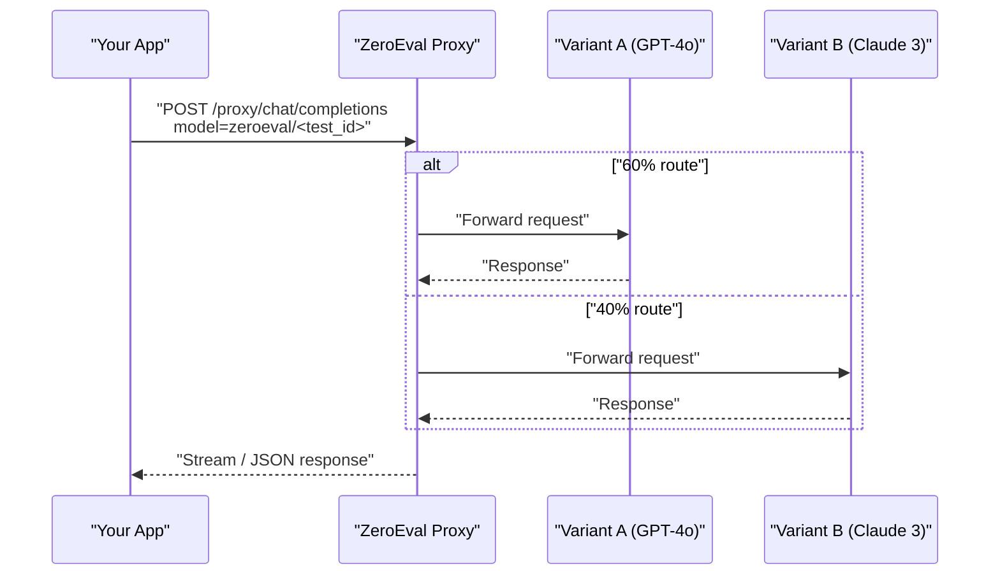

## Why a proxy?

ZeroEval's **chat completions proxy** lets you compare multiple LLMs ("variants") behind a single endpoint. Your application keeps one client, we handle the smart routing & analytics.

## Endpoint

```
https://api.zeroeval.com/proxy
```

It speaks the OpenAI Chat Completions API – just flip the base URL.

## 3-step quickstart

### 1. Point your client to the proxy

```python title="Python – openai>=1.3.0"
from openai import OpenAI

client = OpenAI(
    api_key="ZEROEVAL_API_KEY",            # issued by ZeroEval dashboard
    base_url="https://api.zeroeval.com/proxy"  # 👈 key change
)
```

```ts title="JavaScript / TypeScript"
import OpenAI from "openai";

const openai = new OpenAI({
  apiKey: "ZEROEVAL_API_KEY",                 // issued by ZeroEval dashboard
  baseURL: "https://api.zeroeval.com/proxy",  // 👈 key change
});
```

### 2. Reference your A/B test via the `model` field

Every A/B test has an ID, e.g. `a67d75b`. Set the model string to:

```
zeroeval/<YOUR_TEST_ID>
```

When a request arrives, ZeroEval picks a variant according to the _traffic split_ you configured and forwards the call to that LLM.

```python
completion = client.chat.completions.create(
    model="zeroeval/a67d75b",
    messages=[{"role": "user", "content": "Hello!"}]
)
print(completion.choices[0].message.content)
```

### 3. Iterate – no infra changes

Swap variants or adjust volumes in the dashboard at any time; your app code stays exactly the same.

### Full flow diagram



## Tips & tricks

• Works with streaming – set `stream=True` / `stream: true` as usual.  
• List available provider models via `GET /proxy/models`.  
• Need direct calls too? Use provider prefix, e.g. `model="openai/gpt-4o"` bypasses the test. 