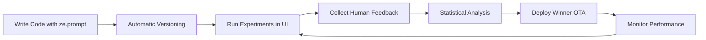

# Introduction to Autotune

ZeroEval's autotune is a powerful feature that enables you to continuously improve your LLM applications through automated experimentation and deployment. 

## What is Autotune?

Autotune is an intelligent system that:

- **Versions every prompt automatically** - Each change creates a trackable version
- **Tests multiple models and prompts** - Find the best combinations for your use case
- **Deploys winners instantly** - No code changes or restarts required
- **Learns from production data** - Continuously improve based on real usage

## Why Use Autotune?

<CardGroup cols={2}>
  <Card title="Optimize Performance" icon="chart-line">
    Find the perfect prompt/model combination that delivers the best results for your specific use case
  </Card>
  <Card title="Reduce Costs" icon="dollar-sign">
    Automatically discover cheaper models that perform just as well or better for your tasks
  </Card>
  <Card title="Save Time" icon="clock">
    Stop manually testing prompts - let the system find the best configuration automatically
  </Card>
  <Card title="Deploy Instantly" icon="rocket">
    Winners deploy over-the-air without touching your codebase or restarting services
  </Card>
</CardGroup>

## How It Works



### 1. Simple Integration

Replace hardcoded prompts with `ze.prompt()`:

```python
# Before
prompt = "You are a helpful assistant"

# After - with autotune
prompt = ze.prompt(
    name="assistant",
    content="You are a helpful assistant"
)
```

### 2. Automatic Model Injection

Your specified model gets replaced with the tuned winner:

```python
# You write this
response = client.chat.completions.create(
    model="gpt-4",  # ← Gets replaced!
    messages=[{"role": "system", "content": prompt}]
)

# But the tuned model runs (e.g., claude-3-sonnet)
```

### 3. Zero-Downtime Updates

When you find a better prompt/model combination:
- No code changes needed
- No service restarts
- Updates propagate instantly
- Different environments can use different versions

## Key Concepts

<AccordionGroup>
  <Accordion title="Content-Based Versioning">
    Every unique prompt content gets a SHA-256 hash. This ensures reproducibility and makes it easy to track which exact prompt version produced which results.
  </Accordion>
  
  <Accordion title="Prompt Decoration">
    `ze.prompt()` wraps your content with invisible metadata that our SDK uses to identify and patch the correct model at runtime.
  </Accordion>
  
  <Accordion title="Statistical Ranking">
    We use the TrueSkill algorithm to rank prompt/model combinations based on human feedback, ensuring statistically significant results.
  </Accordion>
  
  <Accordion title="Environment Awareness">
    Deploy different versions to staging vs production, or use tags like "stable" and "canary" for gradual rollouts.
  </Accordion>
</AccordionGroup>

## Quick Example

Here's autotune in action for a customer support bot:

```python
import zeroeval as ze
from openai import OpenAI

ze.init()
client = OpenAI()

# Define your prompt with version tracking
system_prompt = ze.prompt(
    name="support-bot",
    content="""You are a customer support agent for {{company}}.
    Be helpful, concise, and professional.""",
    variables={"company": "TechCorp"}
)

# Use it normally - model gets patched automatically
response = client.chat.completions.create(
    model="gpt-4",  # This might run claude-3-sonnet in production!
    messages=[
        {"role": "system", "content": system_prompt},
        {"role": "user", "content": "I need help with my order"}
    ]
)
```

After running experiments, you might find that Claude 3 Sonnet with a slightly modified prompt performs 30% better at 50% of the cost. This winning combination deploys automatically!

## Get Started

Ready to optimize your LLM applications?

<CardGroup cols={2}>
  <Card title="Setup Guide" icon="wrench" href="/autotune/setup">
    Learn how to integrate ze.prompt() into your codebase
  </Card>
  <Card title="Tuning Guide" icon="sliders" href="/autotune/tuning">
    Run experiments and deploy winning combinations
  </Card>
</CardGroup>

