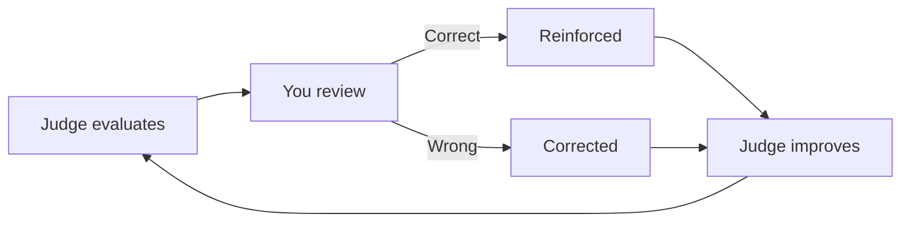

Judges are AIs that give feedback to your agent's interactions -- individual messages, full conversations, or entire workflows. They evaluate spans, traces, and sessions against criteria you define, scoring outputs automatically so you don't have to review every response manually.

Judges calibrate over time. The more you correct their evaluations, the more accurate they become at catching the issues that matter to your use case.

## Built-in judges

ZeroEval ships with out-of-the-box judges that detect common failure patterns without any configuration:

- **User corrections** -- detects when a user rephrases or corrects the agent's output
- **User frustration** -- identifies signs of dissatisfaction, confusion, or repeated requests
- **Task failures** -- catches when the agent fails to complete the user's request
- **Hallucinations** -- flags responses that contain fabricated or unsupported claims
- **Safety violations** -- detects harmful, biased, or policy-violating content

## Suggested judges

Based on your production traffic, ZeroEval can suggest judges that would be useful for your specific use case. As traces flow in, we analyze patterns in your agent's behavior and recommend evaluation criteria tailored to the failures and edge cases we observe.

## Custom judges

Create your own judges to evaluate anything specific to your domain:

- Response quality (helpfulness, tone, structure, completeness)
- Domain accuracy (legal, medical, financial correctness)
- Format compliance (JSON output, specific templates, length constraints)
- Business rules (pricing accuracy, policy adherence, SLA compliance)

## Creating a judge

<Steps>
  <Step title="Define your criteria">
    Go to [Monitoring → Judges → New
    Judge](https://app.zeroeval.com/monitoring/judges). Choose between a
    **binary** judge (pass/fail) or a **scored** judge (rubric with multiple
    criteria).
  </Step>
  <Step title="Write the evaluation prompt">
    Specify what the judge should look for in your agent's output. Tweak the
    prompt until it matches the quality bar you're aiming for.
  </Step>
  <Step title="Judge starts evaluating">
    Historical and future traces are scored automatically. Results appear in the
    dashboard immediately.
  </Step>
</Steps>

## Calibration

AI judges are powerful but imperfect. Out of the box, a judge might:

- **Miss nuance** -- flag a correct but unconventional answer as wrong
- **Be too lenient** -- let low-quality responses pass because they're grammatically correct
- **Misinterpret context** -- score domain-specific content poorly because it lacks your business context

This is expected. A judge's first evaluations are a starting point, not a finished product.

The fix is simple: **correct the judge when it's wrong**. Each correction teaches the judge what "good" and "bad" look like for your specific use case. Over time, the judge converges on your quality bar.

<Card title="Calibration Guide" icon="bullseye" href="/judges/calibration">
  Learn how to correct judge evaluations in the dashboard or programmatically
  via SDK to improve accuracy over time.
</Card>

<Tip>
  Using Cursor, Claude Code, or another coding agent? The [`create-judge`
  skill](/integrations/skills) can help you pick an evaluation type, write the
  template, and create the judge without leaving your editor.
</Tip>
